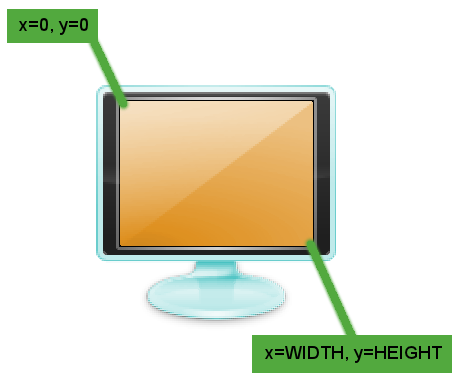
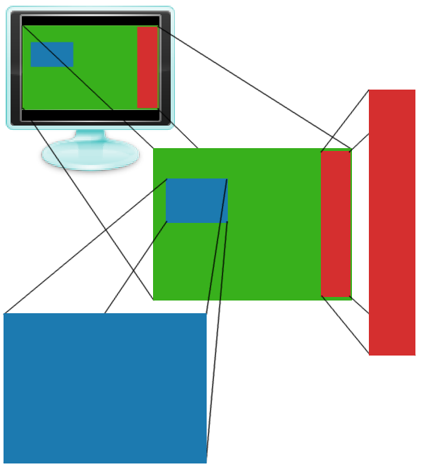

Introduction
============

About
-----

`info-beamer` is an interactive multimedia presentation framework. It is
somewhat similar to [fluxus](http://www.pawfal.org/fluxus/) or
[processing](http://processing.org/). `info-beamer` allows you to create
impressive realtime visualisations using the [Lua programming
language](http://www.lua.org/).

Table of Contents
-----------------

[TOC]

Installing info-beamer
======================

`info-beamer` is currently focused on Linux. It has been tested on Ubuntu
and Fedora.

Dependencies
------------

`info-beamer` tries to have dependencies that are available for most linux
distributions. It shouldn't be necessary to compile obscure packages before
compiling `info-beamer`. Here are the required 3rd party packages:

Dependency          |  Why?
--------------------|---------------------------
lua (5.1)           |  for scripting (Note: lua 5.2 is *not* supported)
libevent (>2.0)     |  io multiplexing
glfw                |  opengl initialization
GL & GLU            |  opengl & utility functions
GLEW                |  accessing opengl extensions
ftgl                |  truetype font rendering for opengl
DevIL               |  reading image files
libavformat         |  video decoding
libavcodec          | 
libavutil           | 
libswscale          | 
libz                | 
markdown (python)   | (optional) for rebuilding the documentation

### Prerequisites on Ubuntu

Ubuntu provides all required packages. Just execute the following command:

    :::console
	user:~$ apt-get install liblua5.1-dev libevent-dev libglfw-dev \
		libglew1.5-dev libftgl-dev libavcodec-dev libswscale-dev \
		libavformat-dev libdevil-dev lua5.1

Building From Source
--------------------

`info-beamer` is provided as a source release on
[http://github.com/dividuum/info-beamer](http://github.com/dividuum/info-beamer).
The best way to install `info-beamer` is to clone the github repository and
type `make` inside the root directory:

    :::console
    user:~/src$ git clone https://github.com/dividuum/info-beamer.git
    [...]
    user:~/src$ cd info-beamer
    user:~/src/info-beamer$ make
    [...]
    user:~/src/info-beamer$ ./info-beamer 
    Info Beamer rev-foobar (http://info-beamer.org/)
    Copyright (c) 2012, Florian Wesch <fw@dividuum.de>

    usage: ./info-beamer <root_name>

Troubleshooting
---------------

### /usr/bin/ld: cannot find -llua5.1

I didn't find a reliable way to detect the library name for lua5.1. I'm
using the linker flag -llua5.1 for linking. If your lua 5.1 library is
called liblua.so, try the following `make` command line:

    :::console
    user:~/src/info-beamer$ LUA_LDFLAGS="-llua" make

Installation
------------

There is nothing special to do. `info-beamer` consists of only a single
binary called `info-beamer`. You can move it to any directory you like
(e.g. `/usr/local/bin`). Or you can call `make install` to install
`info-beamer` into `/usr/local/bin`.

    :::console
    user:~/src/info-beamer$ sudo make install
    install -o root -g root -m 755 info-beamer /usr/local/bin/

First Steps
===========

Hello World
-----------

`info-beamer` uses directories as presentable units. A minimal example
consists of a single directory (called a node) containing a font file and a
control file `node.lua`. Let's look at the example code in `samples/hello`:

    :::lua
    gl.setup(1024, 768)

    font = resource.load_font("silkscreen.ttf")

    function node.render()
        font:write(120, 320, "Hello World", 100, 1,1,1,1)
    end

Let's look at each line:

    :::lua
    gl.setup(1024, 768)

This call will initialize a virtual screen of width 1024 and height 768.
The virtual screen is the node's window to the world. The virtual screen is
scaled up to the available display space.

    :::lua
    font = resource.load_font("silkscreen.ttf")

This line will read the Truetype font `silkscreen.ttf` and create a font
object `font`. This object can then be used to write output using the font.

    :::lua
    function node.render()
        font:write(120, 320, "Hello World", 100, 1,1,1,1)
    end

`info-beamer` will call the function `node.render` for each frame it will
display on the screen. Inside of `node.render` it's up to you to decide
what do show on each frame. In this example we use the previously create
`font` object to write `"Hello World"` to the virtual screen.

The first two parameters of `write` are the x and y Position on the virtual
screen. `x` is the horizontal position. A value of 0 is the leftmost
position. `y` is the vertical position. The value 0 is the topmost
position. Therefore `x=0, y=0` is in the topleft corner of the virtual
screen.

`"Hello World"` is obviously the value we want to put on the virtual
screen.  `100` is the size of the output in screen units. `1,1,1,1` is
color in RGBA format (a bright white).

To display this example using `info-beamer`, switch into the `info-beamer`
source directory and type

    :::console
    user:~/src/info-beamer$ ./info-beamer samples/hello

This will start `info-beamer`. It will open the directory `hello` (called
the `hello` node) and look for the file `node.lua`. This should get
you a new window showing the "Hello World" text in the center to the
screen. 

`info-beamer` is a rapid development environment. If you update the code
for your example and save it, `info-beamer` will pick up the changes and
show them to you immediately. Let's try this: While `info-beamer` is still
running and displaying the "Hello World", change the string "Hello World"
to "Updated World" in `node.lua` and save the file `node.lua`.
`info-beamer` will notice that the file changed and reload it. The output
window will now show the text `"Updated World"` to you!

Displaying Content
------------------

### Images

`info-beamer` can load more than just font files. It will load various
image formats using the `resource.load_image` function. Code using this
function might look like this:

    :::lua
    gl.setup(1024, 768)

    background = resource.load_image("background.jpg")

    function node.render()
        background:draw(0, 0, WIDTH, HEIGHT)
    end

The image `background.jpg` will be loaded into the image object
`background`. Inside `node.render` this background image is the drawn from
coordinates `0, 0` (top left corner of the virtualscreen) to `WIDTH,
HEIGHT` (bottom right corner of the screen). WIDTH and HEIGHT will be
initialized with the values from the `gl.setup` call.

### Videos

You can load videos and display them. Doing so is quite similar to image
loading:

    :::lua
    gl.setup(1024, 768)

    video = resource.load_video("video.mp4")

    function node.render()
        video:next()
        video:draw(0, 0, WIDTH, HEIGHT)
    end

`video` now contains a video object. Calling `video:next` will read the
next frame of the video. `video:draw` will then display this frame. You'll
notice that video playback will be too fast. Since `node.render` is called
for each frame `info-beamer` wants to display, it's most likely that this
function will be called 60 times per seconds (the refresh rate of your
monitor).  Likewise your video might have 25 frames per seconds. So
you'll have to slow down decoding to the actual framerate of the video.
`util.videoplayer` will do all of this for you:

    :::lua
    gl.setup(1024, 768)

    video = util.videoplayer("video.mp4")

    function node.render()
        video:draw(0, 0, WIDTH, HEIGHT)
    end

`util.videoplayer` is a helper function that provides a small wrapper
around video resources. It will automatically decode the video using the
correct framerate.

### Rendering Child Nodes

A directory (called a node) can contain subdirectories. Each subdirectory
is then loaded as a child node. The parent node can render child nodes like
any other resource. Let's say we create two nodes called `blue` and `red`.
We can let `info-beamer` play each of them individually. But what if we
want to combine them for our presentation? This is where the nesting
feature of `info-beamer` becomes useful. You start by creating another node
called `green`. Then you just move the directories for node `blue` and
`red` into the directory `green`. The file tree will the look like this:

    :::text
    -+- green -+- node.lua
               |
               +- red ---- node.lua
               |
               '- blue --- node.lua

Inside of `green` you can then render both `red` and `blue` into an image
object using `resource.render_child` and display them on `green`s virtual screen.

The above setup is available in the directory `samples/green`. It contains
`node.lua` and two child directories called `red` and `blue`.  Let's look at
`green/node.lua`:

    :::lua
    gl.setup(800, 600)

    function node.render()
        gl.clear(0, 1, 0, 1) -- green

        -- render to image object and draw
        local red = resource.render_child("red")
        red:draw(640, 20, 780, 580)

        -- render an draw without creating an intermediate variable
        resource.render_child("blue"):draw(50, 200, 300, 380)
    end

It creates a new virtual screen sized 800x600. For each frame it clears the
screen using `gl.clear` with a bright green.

Then it renders the child node `red` (aka the subdirectory `red`) into
a new image object called `red` and draws it into the square from `640,20` to
`780,580`. The sourcecode for `green/red/node.lua` looks like
this:

    :::lua
    gl.setup(100, 800)

    function node.render()
        gl.clear(1, 0, 0, 1) -- red
    end

It starts by setting up a 100x800 screen. Each time it is is rendered
(which happens if `resource.render_child` is called), the child clears the
screen by calling `gl.clear` with the color red. 

`green/blue/node.lua` looks almost identical but clears the screen with a
bright blue:

    :::lua
    gl.setup(640, 480)

    function node.render()
        gl.clear(0, 0, 1, 1) -- blue
    end

You can start the example like this:

    :::console
    user:~/src/info-beamer/samples$ ../info-beamer green

You can also start both childs on their own:

    :::console
    user:~/src/info-beamer/samples$ cd green
    user:~/src/info-beamer/samples/green$ ../../info-beamer red

or 

    :::console
    user:~/src/info-beamer/samples/green$ ../../info-beamer blue

This is a great feature: You can develop nodes independently and later
include them in other nodes. 

### Rendering from VNC

`info-beamer` contains another useful feature for including content. It can
act as a VNC client. VNC is a cross platform desktop sharing protocol.
`info-beamer` implements the client side of this protocol. If you setup a
server on a remote machine, `info-beamer` can connect to this machine and
create a VNC object you can use to render the remote desktop in your
presentation. Here is an example:

    :::lua
    gl.setup(1024, 768)

    vnc = resource.create_vnc("192.168.1.1")

    function node.render()
        vnc:draw(0, 0, WIDTH, HEIGHT)
    end

This will try to create a connection to a running VNC server on
`192.168.1.1`. The server must not be password protected (since
`info-beamer` doesn't support any kind of authentication). If you
create the server, be sure that you are in a secure environment. Inside
`node.render` the content of the remote desktop is drawn onto the screen.

### Using GLSL Shaders

`info-beamer` supports GLSL shaders. Shaders are small programs that run on
the GPU.  They enable various realtime effects using the raw power of your
GPU.  Shaders come in pairs: A vertex shader and a fragment shader. Vertex
shaders are responsible for transforming 3D positions. Fragment shaders
then calculate the color displayed on each visible pixel of the transformed
object. Fragment shaders can be used to create stunning realtime effects.
`info-beamer` enables you to pass numeric values and additional textures
into the shader. This allows you to do all kinds of crazy stuff like for
example blending videos with static textures.

`samples/shader` contains a small basic shader example:

    :::lua
    gl.setup(640, 480)

    util.resource_loader{
        "lua.png",
        "shader.vert",
        "shader.frag",
    }

    function node.render()
        gl.clear(1,1,1,1)
        shader:use{
            Effect = math.cos(sys.now()*2)*3
        }
        lua:draw(120, 40, 520, 440)
    end

`util.resource_loader` is a utility function that makes resource loading
very easy. You just give it a number of filenames. It will then detect
which loader is responsible for the given fileformat and load the file into
a global variable whose name is derived from the filename. The above code
will load the image `lua.png` into the global variable `lua`. It will also
load the shader pair `shader.vert` and `shader.frag` into the global
variable `shader`. The resource loader will also make sure that changed
files will be reloaded. So if you edit and save for example `shader.frag`,
`info-beamer` will instantly reload the shader. You can see changes
to your effect immediatelly. This is great for rapidly developing effects.

Inside of `node.render` we first clear the screen. Then we activate the
shader, which was automatically created from the files `shader.vert` and
`shader.frag` by `util.resource_loader`. We pass in a variable `Effect`
which depends on a time value.  Finally, we draw `lua.png` with the
applied shader. This will create a dynamic effect.

Reference
=========

Resource Loading
----------------

### image = resource.load\_image(filename)

Loads the image file specified by `filename` into a texture object.
Please note that image loading is case sensitive. `info-beamer` supports
most common file formats.

The returned `image` objects supports the following methods:

#### image:draw(x1, y1, x2, y2)

Draws the image into a rectangle specified by the give coordinates.

#### width, height = image:size()

Returns the size of the image.

### video = resource.load\_video(filename)

Loads any supported video file and returns a 
`video` object. The `video` objects supports the following methods:

#### video:draw(x1, y1, x2, y2)

Draws the current video frame into a rectangle specified by the give coordinates.

#### has\_next\_frame = video:next()

Decodes the next frame of the video. Returns true, if a frame was decoded
or false if there was no next frame.

#### width, height = video:size()

Returns the size of the video.

#### fps = video:fps()

Returns the frame per seconds as specified by the video file.

### font = resource.load\_font(filename)

Loads the given Truetype font file and returns a `font` object. It
supports the following methods:

#### width = font:write(x, y, text, size, r, g, b, [a])

Writes the provided `text` to the coordinates given in `x` and `y`. The
color is given by `r`, `g`, `b` and `a`, the red, green, blue and alpha
values. The alpha value is optional, the default is 1.0 (opaque). The call
will return the width of the rendered text in screen space.

`text` must be `UTF8` encoded, if you intend to use characters outside the
ascii range.

#### width = font:write(x, y, text, size, texturelike)

Mostly identical to font:write but will not use a solid color but the
texturelike object. `texturelike` can be an image, a video or any other
`texturelike` objects. The texture will be used for each character
individually.

### string = resource.load\_file(filename)

Will load the content of the specified file into a string value.
At most 16kb (16384 bytes) are readable.

### shader = resource.create\_shader(vertex\_shader, fragment\_shader)

Will create a new `shader` object. `vertex_shader` and `fragment_shader`
are strings containing the shaders in the GLSL language.

#### shader:use(table\_of\_shader\_variables)

Will activate the shader and pass in the given variables. A call might look
like this:

    :::lua
    shader:use{
        float_value = 123.45,
        some_texture = image,
    }

You can pass in numerical values. Inside the shader, they will be available
as a float uniform values:

    :::glsl
    uniform float float_value; // will have the value 123.45

Textures (which can be images, videos or any other `texturelike` object)
will be available as a 2d sampler:

    :::glsl
    uniform sampler2d some_texture;

The shader will be active for the rest of execution of the `node.render`
call unless deactivated using `:deactivate`.

#### shader:deactivate()

Deactivates the active shader.

### vnc = resource.create\_vnc(hostname, [port])

This call will create VNC client. It will connect to the specified address.
The remote desktop will be available as a `texturelike` object. If no port
is given, the default value of 5900 will be used.

#### vnc:draw(x1, y1, x2, y2)

Draws the current remote desktop to the screen.

#### width, height = vnc:size()

Returns the size of the remote desktop. Will return 0x0 is the client is
not yet connected to the VNC server.

#### alive = vnc:alive()

Returns a boolean value that indicates if the client is still connected to
the server. If the client was disconnected (which can have various reasons
like an invalid hostname, a closed connection or invalid VNC packets) it
will not automatically reconnect. It's up to you to create a new client if
you need a persistent connection.

### image = resource.render\_child(name)

Renders a child node into an `image` object. Rendering will call
`node.render` within the child.

The returned `image` supports the same methods like images objects created
by `resource.load_image`.

### image = resource.create_snapshot(mipmap)

Copies the current framebuffer output (all things drawn up to this point) 
into a new image. This allows you to feed the output of the node
into a shader in the next iteration.

If `mipmap` is true, the resulting image object will be mipmapped.

This function can only be called inside of `node.render` (or any
functions called from there). 

The returned `image` supports the same methods like images objects created
by `resource.load_image`.

OpenGL Related Functions
------------------------

### gl.setup(width, height)

Initializes the virtual screen of the current node. Will also set the
global variables `WIDTH` and `HEIGHT`.

### gl.clear(r, g, b, a)

Clears the virtual screen using the given color. It also deactivates
the active shader.

### gl.pushMatrix()

Like the native glPushMatrix call, this will save the current ModelView
matrix. This function can only be called inside of `node.render` (or any
functions called from there). To avoid errors, you can only push 20
matrices. This should be more than enough for normal visualisations.

### gl.popMatrix()

Restores a previously saved matrix. Can only be called inside
`node.render`.

### gl.ortho()

Resets the view to an orthogonal projection. It will create a projection
where the topleft pixel of the virtualscreen is at `0`, `0` and the
bottomright pixel is at `WIDTH`, `HEIGHT`. This is the default mode.

Calling this function will discard all matrices pushed by gl.pushMatrix().

### gl.perspective(fov, eyex, eyey, eyez, centerx, centery, centerz)

This will create a perspective projection. The field of view is given by
`fov`. The camera (or eye) will be at the coordinates `eyex`, `eyey`,
`eyez`. It will look at `centerx`, `centery`, `centerz`. The up vector of
the camera will always be `0`, `-1`, `0`.

Here are some useful values to try if you want to switch from `gl.ortho` to
`gl.perspective`:

    :::lua
    gl.perspective(
        60,
        WIDTH/2, HEIGHT/2, -WIDTH/1.6,
        WIDTH/2, HEIGHT/2, 0
    )

### gl.rotate(angle, x, y, z)

Produces a rotation of `angle` degrees around the vector `x`, `y`, `z`.
Consider using `gl.perspective` to see the scene in perspective mode. It
might look better.

Calling this function will discard all matrices pushed by gl.pushMatrix().

### gl.translate(x, y, [z])

Produces a translation by `x`, `y`, `z`. `z` is optional and defaults to
`0`.  Consider using `gl.perspective` to see the scene in perspective mode.
It might look better.

### gl.scale(x, y, [z])

Scales by the given factors. `z` is optional and defaults to `1`.

Misc Functions
--------------

### sys.now()

Returns a timestamp as a floating point number that will increment by 1 for
each passing second. The timestamp is relative to the start of `info-beamer`.

Node Functions
--------------

### node.render()

You should overwrite this function with your own code. This function will
be called by `info-beamer` (or by a parent node using
`resource.render_child`). It should create the current scene.

### node.alias(new_alias)

Nodes always have a name and a path. The `name` is the directory name of the
node. The `path` is the full path to the node from the toplevel node.

If you send data to a node using TCP (see the `input` event) or UDP (see
`osc` and `data` events), you address the node using its full path. Using
`node.alias`, you can give your node an alias name. This name must be
unique in a running `info-beamer` instance.

### node.event(event\_name, event\_handler)

Registers a new event handler. Possible `event_name`s are described below.
Event handlers cannot be unregistered. Event handlers will be called in the
order of registration.

Node Events
-----------

`info-beamer` allows you to listen to various events. All events must be
registered using `node.event`. The following events are available:

### node.event("child\_add", function(child\_name) ... end)

Registers an event handler that is called if `info-beamer` detects that a
child node was added to the current node. The name of the new child node is
provided in `child_name`. Example usage:

    :::lua
    node.event("child_add", function(child_name)
        print("new child " .. child_name .. " added")
    end)

### node.event("child\_remove", function(child\_name) ... end)

Registers an event handler that is called if `info-beamer` detects that a
child node was removed from the current node. The child name is provided in
`child_name`.

### node.event("content\_update", function(filename) ... end)

Registers an event handler that is called if `info-beamer` detects that a file was
created or modified in the current node. This allows you to detect updated
resources. 

### node.event("content\_remove", function(filename) ... end)

Registers an event handler that is called if `info-beamer` detects that a
file was removed from the current node.

### node.event("data", function(data, suffix) ... end)

Registers a new event handler that will be called if UDP data is sent to
the node. You can send udp data like this:

    :::console
    user:~$ echo -n "path:data" | netcat -u localhost 4444

Where `path` is the complete path to the node (in case of nested nodes) and
maybe a suffix. `data` is the data you want to send. `info-beamer` listens for
incoming UDP packets on port 4444.

`info-beamer` will dispatch packets to the node that best matches the
specified path.  Let's say you have two nodes:

    :::text
    nested
    nested/child

If you send a packet to `nested`, the `data` callback will be called in the
node `nested`. If you send a packet to `nested/child/foobar` the `data`
callback will be called in `nested/child`. `suffix` will have the value
`foobar`. See `util.data_mapper` for an easier way to receive and dispatch
udp data packets. You can give your node a unique alias name using
`node.alias`.  This might be useful if you use OSC clients that don't
support changing the paths they create.

### node.event("osc", function(suffix, ...) ... end)

`info-beamer` also supports OSC (open sound control) packets via UDP. If
you send an OSC packet containing a float to `node/slider/1`, the `osc`
callback will be called with the suffix `slider/1` and the decoded osc
values. See `util.osc_mapper` for an easier way to receive and dispatch osc
packets.

### node.event("input", function(line) ... end)

`info-beamer` allows incoming TCP connections to port 4444. You'll be
greeted by a welcome line and are expected to provide a node name.
`info-beamer` will return `ok!` if you provide a valid node name. From this
moment on, `info-beamer` will feed you the output of the node. This can be
used for debugging a node from remote.

	:::console
	user:~$ telnet localhost 4444
	Info Beamer 0.2-beta.fdd72a (http://info-beamer.org/). Select your channel!
	nested/child
	ok!
	[node output]

Any text you type while connected will trigger the `input` event. The
`input` event will be given the provided line. This can be used to feed a
node with input from outside sources.

    :::lua
    node.event("input", function(line)
        print("Input was: " .. line)
    end)

Utility Functions
-----------------

All utility functions could be rewritten using the functions decribed
above. They are provided for your convenience.

### util.resource\_loader(table\_of\_filenames)

Creates a resource loader that will load the resources from the given
filenames and put them in global variables. Example usage:

    :::lua
    util.resource_loader{
        "font.ttf",
        "image.jpg",
        "video.mp4",
        "shader.vert",
        "shader.frag",
    }

This will load the font `font.ttf` and put the font object into the global
variable `font`. The global variable `image` will contain the image object.
And so on.

The `util.resource_loader` will also detect changes to the files and reload
them.

### target = util.auto\_loader([target])

Creates a resource loader that tries to automatically load all files found
in the node's directory. It will put the loaded resources into the table
given by `target`. If no table is provided, the `auto_loader` will create a
new table and return a reference. Use it like this to autoload resources
into the global namespace:

    :::lua
    util.auto_loader(_G)

    -- if a file some_image.jpg existed, it is now available
    -- as a global variable:
    print(some_image:size())

Or if you want to avoid name collisions with existing global variables, you
can use `auto_loader` like this:

    :::lua
    resources = util.auto_loader()

    -- if a file some_image.jpg existed, it will now be available
    -- in the table resources:
    print(resources.some_image:size())

`util.auto_loader` autoloads files before returning and watches for changes
afterwards.

### util.file\_watch(filename, handler)

Registers a handler that watches a file. The handler will be called once
while calling `util.file_watch` and every time the file changes. The
handler will receive the content of the file as a string. 

`util.file_watch` can for example be used the keep variables in sync with a
config file:

	:::lua
	util.file_watch("banner.txt", function(content)
		text = content
	end)

	function node.render()
		print(text)
	end

### util.shaderpair\_loader(basename)

Loads the vertex and fragment shader from two files called `basename.vert`
and `basename.frag` and returns a shader objects.

### util.set\_interval(interval, callback)

Adds a callback that will be called immediatelly and then each `interval`
seconds if possible. The `callback` will only be called if the node is
rendered: So it must be either the toplevel node or a node rendered with
`resource.render_child`.

### util.post\_effect(shader, shader_opt)

Applies a shader effect to the current node output. This works by
snapshotting the current output using `resource.create_snapshot`, clearing
the output and drawing the snapshot with the given shader and its options.

### util.osc\_mapper(routing\_table)

Will create a OSC mapper that makes if simple to dispatch OSC messages to
different functions. Think of it as Url-routing for OSC messages:

    :::lua
    util.osc_mapper{
        ["slider/(.*)"] = function(slider_num, slider_arg1, ...)
            ...
        end;
        ["fader/1"] = function(fader_args)
            ...
        end;
    }

The example will allow the node to receive two different type of OSC
messages. If the node is called `example`, the following OSC path will
trigger the slider callback function:
    
    :::text
    /example/slider/123

In the callback, the argument `slider_num` will be a string containing the
value `123` while `slider_arg1` will contain the first OSC argument.

### util.data\_mapper(routing\_table)

Provides the same functionality as the `osc_mapper`, but handles simple UDP
packets.

### video = util.videoplayer(filename, [opt\_table])

Provides a small wrapper around `resource.load_video`. Provides simplified
playback of videos by handling framerate issues. `opt_table` is an optional
table containing the key `loop`. It is a boolean value that indicates if
the videoplayer should loop the video.

`util.videoplayer` will return a `video` object that has the following method:

#### video:draw(x1, y1, x2, y2)

Draws the current video frame into a rectangle specified by the give coordinates.

### util.draw\_correct(obj, x1, y1, x2, y2, alpha)

It is often necessary to display images, videos, child nodes or vnc streams
using the correct aspect ratio (so they don't look stretched).
`util.draw_correct` does this for you.

    :::lua
    -- maybe wrong, stretches the image
    image:draw(0, 0, WIDTH, HEIGHT)

    -- keeps aspect ratio
    util.draw_correct(image, 0, 0, WIDTH, HEIGHT)

### pp(variable)

Pretty print the given Lua object.

Global Variables
----------------

### WIDTH

Current width of the virtual screen as set by `gl.setup`. Writing to this
variable has no effect. Use `gl.setup` to change the virtual screen size.

### HEIGHT

Current height of the virtual screen as set by `gl.setup`. Writing to this
variable has no effect. Use `gl.setup` to change the virtual screen size.

### NAME

Name of the current node (its directory name).

### PATH

Complete path of the node. 

### CONTENTS

Table of available files in the directory of the node. The key contains the
filename, the value is the timestamp (comparable to `sys.now()`) of the
last change.

### CHILDS

Table of child nodes. The key contains the childs name. These can the
rendered using `resource.render_child`. The value is a timestamp
(comparable to `sys.now()`) of the first detection of the child node.

FAQ
===

Usage
-----

### Is it possible to run the `info-beamer` in fullscreen mode?

Yes. Just define the environment variable `INFOBEAMER_FULLSCREEN` to any
non-empty value.

    :::console
	user:~$ INFOBEAMER_FULLSCREEN=1 info-beamer xyz

### Port 4444 is already in use. How can I use another port?

Set the environment variable `INFOBEAMER_PORT`. The specified port will be
used for both TCP and UDP.

### How can fetch content from HTTP?

You can't do that from within your node code. `info-beamer` doesn't support
HTTP and likely never will, since there is a better way to do this: Just
use an external program of you choice to do the HTTP requests. Then write
the result into files within the nodes directory. The node can then pickup
these files to display them.

This also makes the node stateless: Since the files are persisted in the
filesystem, restarting the `info-beamer` won't lose any information.

### Can I use existing Lua code or libraries?

Maybe. The Lua environment that is provided for a node is sandboxed. All
potentially harmful functions (like `os.execute`) have been removed. 

`require` has been wrapped to only load Lua modules from the current
directory. Most simple Lua modules should work out of the box. Here is a
JSON example:

Download the [JSON
module](https://raw.github.com/luaforge/json/master/json4lua/json/json.lua)
and put in your node directory. From within your node code you can then
`require` this module, just as you would in normal Lua code:

	:::lua
	json = require "json"
	print(json.encode{foo = "bar"})

Native modules or precompiled modules cannot be loaded.

### Can I automatically load json / lua files?

Yes. The auto_loader uses the table util.loaders. Entries in this table map 
filename suffixes to loader functions. These functions are called with a 
filename and are expected to return a value or raise an error.

To automatically load json files, use the following code:

    ::lua
    json = require "json" -- see previous faq

    util.loaders.json = function(filename)
        return json.decode(resource.load_file(filename))
    end

    -- invoke the autoloader
    util.auto_loader(_G)

To automatically parse and evaluate all lua files except those that
where previously loaded using `require`, use the following code:

    ::lua
    util.loaders.lua = function(filename)
        local name, suffix = filename:match("(.*)[.]([^.]+)$")
        if package.loaded[name] then
            error("ignoring " .. name .. ": already loaded as module")
        end
        return assert(loadstring(
            resource.load_file(filename), "=" .. PATH .. "/" .. filename
        ))()
    end 

    -- invoke the autoloader
    util.auto_loader(_G)

Misc
----

### Lua sucks! Why not Javascript/Python/other language of your choice?

Lua is a fast. This is important, since the function `node.render` is
called for each frame. Lua is small and simple. If you did any programming
in another language, you should be able to learn the Lua basics in a few
hours. 

Lua can be sandboxed. Memory and CPU usage can be restricted.  Multiple Lua
environments (one for each node) can be created. This isolates nodes from
each other and provides a clean environment to develop your code. If your
node runs on your machine, you can be sure it'll run on any other
`info-beamer`.

External scripting is an important part of the `info-beamer`. It's
perfectly valid to do part of your nodes logic in an external script (for
example to fetch data from twitter), write the data to a file and
use the `info-beamer` to visualize the content. Instead of files you can
also use UDP, OSC or TCP to update your node from any language.

### Where is the Windows/OSX version?

There is none. The `info-beamer` is currently linux only.

### Can I use luajit2?

Yes. Although some sandboxing features will be disabled: luajit2 uses
its own allocator which cannot be overwritten, so limiting memory 
usage isn't possible. Aborting nodes that use too much CPU time might
be unreliable. If you only run nodes you trust, this shouldn't be a 
problem.

To use `info-beamer` in combination with luajit2, call `make` like this:

    ::console
    $ USE_LUAJIT=1 make

Or if you compiled your own version of luajit2: 

    $ USE_LUAJIT=1 LUA_CFLAGS=-I../luajit-2.0/src \
      LUA_LDFLAGS=../luajit-2.0/src/libluajit.a make

### kernel load error

The `info-beamer` uses the installed binary `lua` to precompile the
included files `kernel.lua` and `userlib.lua`. `info-beamer` itself uses
the install liblua. If the version number between the lib and the binary
differs, you'll get an error. Make sure the binary `lua` is version 5.1,
then recompile.

    :::console
    $ user:~$ lua -v
    Lua 5.1.4  Copyright (C) 1994-2008 Lua.org, PUC-Rio

Contributing
============

Thanks for your interest in `info-beamer`. `info-beamer` tries to be a
simple framework for building interactive realtime presentations. Lets keep
it that way.

Project Philosophy
------------------

 * Keep it simple. `info-beamer` avoids unnecessary clutter. If a simple external 
   script could solve a problem, there is no need to do it in `info-beamer`. If a
   problem is solvable within Lua, there is no need to include a C-version
   (unless speed prohibits a Lua solution).

 * Keep it small. `info-beamer` is a simple self-contained binary. It shouldn't
   depend on files somewhere in the filesystem. Keep `info-beamer` portable.

 * Keep it robust. `info-beamer` tries to provide a crash free environment. It
   shouldn't be possible to crash `info-beamer` by using the provided API.

 * Keep it safe. `info-beamer` tries to provide a secure environment. Usercode 
   is sandboxed and memory and processing time is limited. It should be
   safe to execute random node code without worrying about malicious
   behaviour.

 * Keep it statefree. It should be possible to develop a node independently
   from other nodes. Composing them shouldn't change their behaviour.
   OpenGL or other state should not leak into or from child nodes.

 * Keep it scriptable. `info-beamer` embraces scripting. Not just from the inside but
   also from the outside. It provides several ways to control a running
   instance: Changing files, sending UDP/OSC packets or using a TCP
   connection. Make it easy to script things.

 * Keep it readable. The core `info-beamer` code tries to be simple. It should be
   possible to read and hopefully understand the complete sourcecode
   in one evening.

 * Keep it compilable. `info-beamer` tries to use libraries that are widely 
   available. It shouldn't be necessary to build obscure dependencies.
   `info-beamer` uses a simple GNU Makefile. It shouldn't be necessary to 
   include a buildsystem that creates files larger than all of `info-beamer`s
   sourcecode combined.

Contributing
------------

Feel free to fork and enhance `info-beamer` and send me pull requests.
Please keep `info-beamer` clean and simple.
